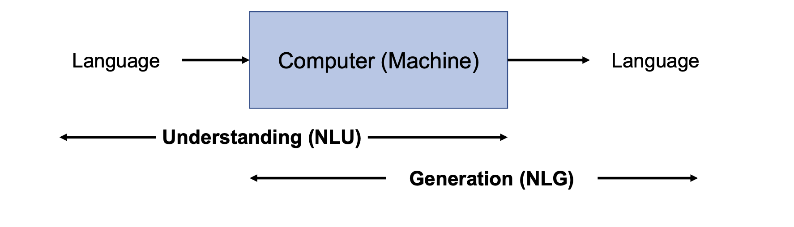
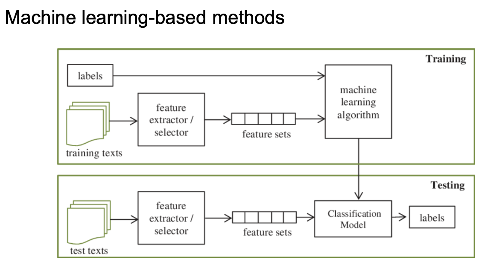
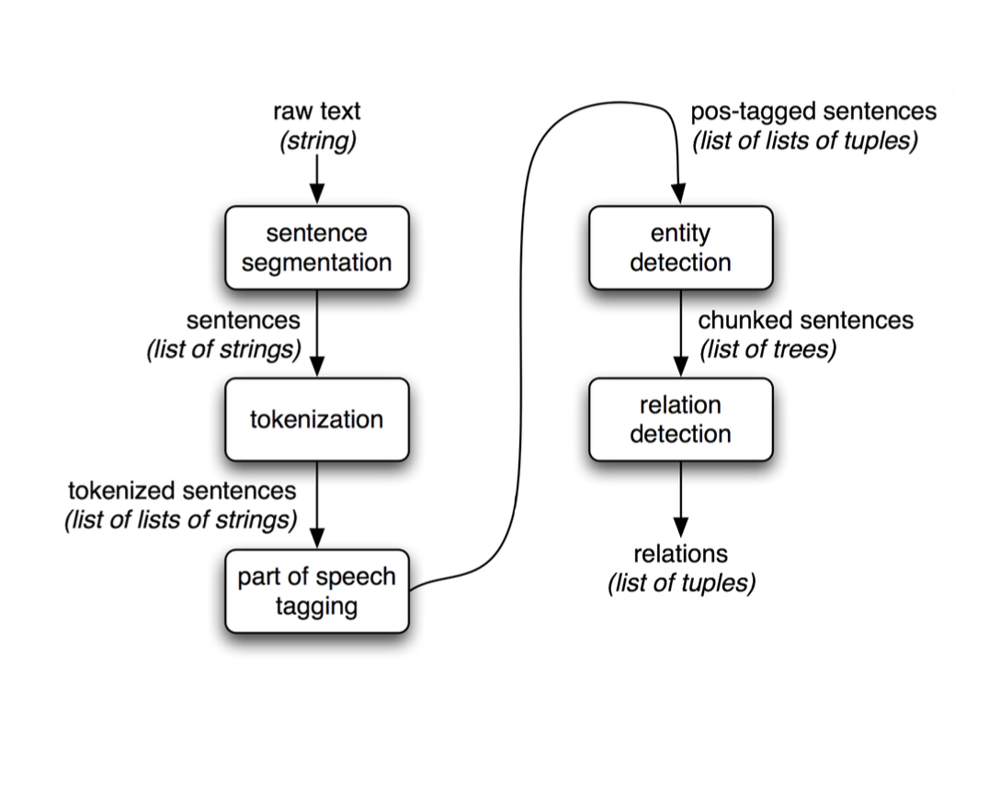

# NLP(Natural language Processing)

- 인간이 사용하는 언어(자연어)를 컴퓨터가 이해하고 처리할 수 있도록 하는 기술
  - 컴퓨터가 인간의 언어를 이해하고, 해석하고, 생성할 수 있도록 하기 위함 

# NLU(Natural Language Understanding)
- NLP의 하위 분야
- 자연어를 보다 깊게 이해하기 위해 연구하는 분야
- 기계가 자연어의 실제 의미 (의도나 감정 등)를 사람처럼 이해하도록 돕는 것

# NLG(Natural Language Generation)
- 기계가 자연어 (사람의 언어)를 직접 생성하도록 돕는 기술
-  자연어처리의 또 다른 하위 집합
-  데이터나 정보를 기반으로 문장을 생성하는 것을 목표

  

# NLP 분야

### Text classification
- 텍스트 데이터를 특정 카테고리로 분류하는 작업

  

### Sentiment analysis

-  텍스트 데이터를 분석하여 그 안에 담긴 감정이나 의견을 파악하는 작업
-  사용자 피드백, 소셜 미디어 글, 리뷰, 설문 조사 응답 등을 분석하는 데 사용
-  

### Information extraction(IE)
- 비정형 텍스트에서 특정한 정보를 자동으로 추출하는 작업

  

### Translation
- 번역

### Text summarization
- 긴 문서나 텍스트에서 중요한 정보를 추출하여 짧고 간결하게 요약하는 작업
- 크게 두 가지로 나뉨
  - 추상적 요약
    - 원본 텍스트의 내용을 이해하고 새로운 문장을 생성하여 요약
  - 추출적 요약
    - 원문에서 중요한 핵심 문장 또는 단어구를 몇 개 뽑아서 이들로 구성된 요약문을 만드는 방법

## NLG

- 위 내용 참고

# Paradigms on NLP

- Language Modeling
  - 자연어 처리(NLP)에서 컴퓨터가 언어의 확률적 구조를 학습하여 문장을 이해하고 생성할 수 있도록 하는 기술입니
  - 언어 모델링의 주된 목표는 **주어진 단어들을 기반으로 다음에 나올 단어의 확률을 예측하는 것**
  - LLM Histroy
    - NLM-PLM-LLM
      - 신경망을 사용해 언어 모델링
      - 신경망을 사전학습 후 특정 작업에 따라 미세조정
      - PLM에서 모델 & 데이터 크기를 확장
- RNN(Recurrent Neural Networks):
  -  순차 데이터를 다루기 위해 순환 신경망을 사용하여 문맥을 기억하고 다음 단어를 예측하는 방식입니다.
  -  이전의 입력 데이터를 기억하고 이를 활용해 현재의 출력에 반영하는 특징을 가지고 있어, 시간이나 순서에 따라 변하는 데이터를 처리할 수 있습니다.
  -  연속적인 데이터에서 연속된 변수들 간의 Dependency를 반영
  -  순차적으로 입력하고, 순차적으로 예측하는 알고리즘
- seq2seq
  - 문장을 문장으로 변환하는 모델
  - Encoder와 Decoder로 이루어져 있으며, 문장 간의 의미적 관계를 학습하여 복잡한 NLP 작업을 수행
  - Encoder
    - 입력 시퀀스에 포함된 정보들을 부호화하여 context vector 생성
    - context vector
      - 입력 시퀀스를 처리한 후에 생성하는 고정된 길이의 벡터입니다. 이 벡터는 입력된 전체 시퀀스의 정보를 압축해서 하나의 벡터로 요약한 것입니다
  - Decoder
    - Encoder로부터 context vector를 전달받아 출력 시퀀스 생성
  - Decoder가 단어 예측시 Encoder의 마지막 시점 정보인 context vector만 사용
  - 단점
    - 제한된 고정 길이의 벡터이기에 충분히 표현 불가능
    - 입력 시퀀스가 길어질수록 이전 정보를 기억하기 힘듦
    - 
  # Attention 기법 
  - 기존에 문장을 처리할 때 단어들을 순차적으로 처리한 후, 마지막에 얻은 hidden state(문맥 벡터)를 바탕으로 전체 문장을 요약했다. 하지만 긴 문장을 처리할 때 마지막 hidden state 하나로 전체 문장의 의미를 충분히 전달하기 어려움.
  -  어텐션 메커니즘은 디코더가 **매 시점마다 인코더의 모든 Context Vector(hidden state)에 주목할 수 있게 하는 방법.** 즉 encoder의 모든 시점을 decoder에 전달
   - 중요한 정보에 더 집중할 수 있도록 가중치를 부여하는 것입니다. 이를 통해 고정된 문맥 벡터로 모든 정보를 압축하는 대신, 필요한 정보를 선택적으로 사용하게 되어 성능이 크게 향상됩니다.

# Background for LLMs
- LLM: 방대한 텍스트 데이터로 학습된 수천 억개의 파마리터를 가진 TLM
- Emergent Abilities: 작은 모델에서는 나타나지 않지만, 거대한 모델에서 발현되는 능력
# transformer 모델이란?
-  인코더-디코더를 따르면서도, 어텐션(Attention)만으로 구현한 모델입니다.
- 기존의 seq2seq처럼 인코더에서 입력 시퀀스를 입력받고, 디코더에서 출력 시퀀스를 출력하는 인코더-디코더 구조를 유지하고 있습니다
- 어텐션 메커니즘을 활용하여 순차적 데이터를 병렬로 처리하는 딥러닝 모델
- Self-Attention(자기 어텐션):
  - 입력 시퀀스 내에서 각 단어가 자기 자신을 포함한 다른 모든 단어들과의 관계를 고려하는 어텐션 메커니즘입니다.
- 병렬 처리
- 인코더 디코더 구조
# GPT
- Token Embedding
  - Token Embedding은 자연어에서 각 단어를 벡터로 변환하는 과정입니다.  

## Training Process of LLMs
- Pre-trainnig -> Adaptation Tuning -> Utilization

### Pre-trainnig
- Data
- Architecture
- Pre-training Tasks
  - LLM을 학습하기 위해 langueage modeling task가 가장 많이 사용됨
- Optimization and Scalable Training Techniques

### Adaptation Tuning
- 다양한 task에서 PLM을 효과적으로 더 잘 사용하기 위해 adaptation 시키는 작업
- Instruction Tuning
  - 지시문 & input text와 output text의 pair 데이터 셋을 통해 지도 학습 시키는것
  - 등장배경
    - 사용자의 의도에 맞는 답변 출력
    - zero-shot 성능 향상
- Alinment Tuning
  - 부적절한 답변 등을 방지하기 위해 
  - RLHF
    1. SFT
    2. Reward Model Training
    3. RL Fine-tuning
  - 강화학습을 이용해 인간의 피드백으로부터 LLM을 최적화하는 방법
- Parameter Efiicient Model Adaptaion
  - 많은 비용이 듦
  - Adapter Tuning

### Utilization
- Prompt Engineering
  - LLM이 생성하는 결과물의 품질을 높일 수 있는 입력값들의 조합을 찾는 작업
  - zero-shot
  - One/Few-shot
  - Chain-of-Though 
    - 답변에 도달하는 과정을 학습시키기 위해 목적으로 본 질문 전에 미리 태스크와 추론 과정을 포함한 답변 예제를 제공하는 것.