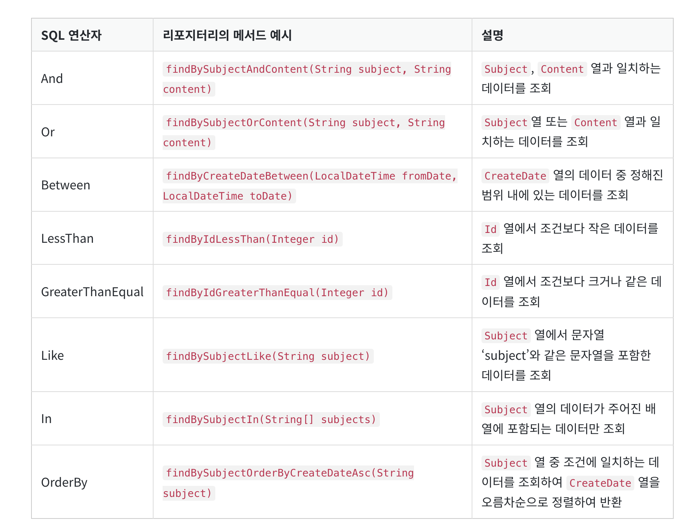
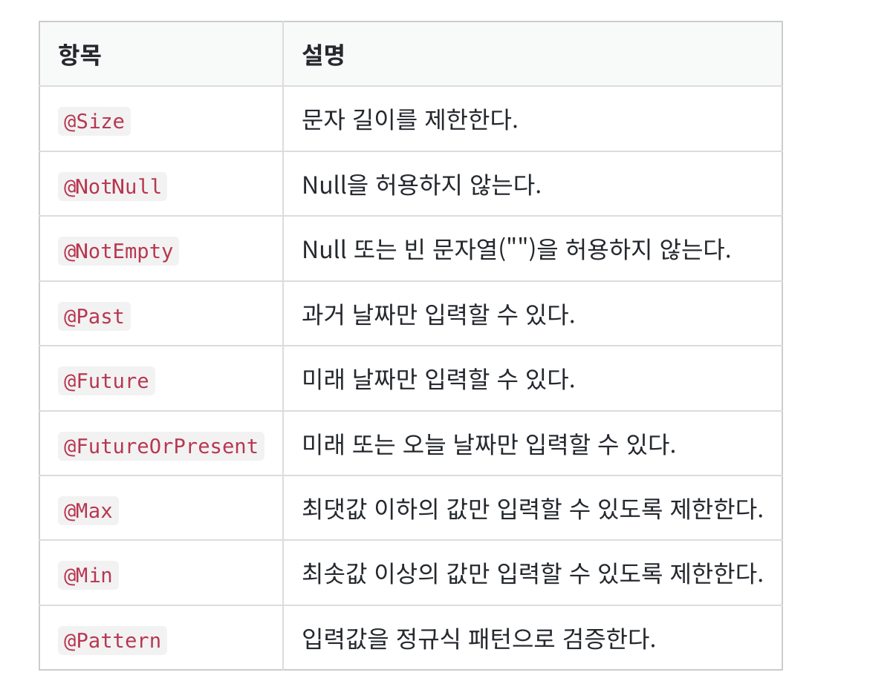

## 클라이언트에서 페이지 요청이 온다면?
1. 가장 먼저 컨트롤러에 등록된 URL 매핑을 찾고,
2.  해당 URL 매핑을 발견하면 URL 매핑과 연결된 메서드를 실행한다.
    - URL 매핑이란?
      -  URL과 컨트롤러의 메서드를 일대일로 연결하는 것을 말한다. 컨트롤러의 메서드에 @GetMapping 또는 @PostMapping과 같은 애너테이션을 적용하면 해당 URL과 메서드가 연결된다.

### Entity
-  데이터베이스의 테이블과 매핑되는 자바 클래스를 말한다.
-  

- 엔티티가 데이터베이스 테이블을 생성했다면, 리포지터리는 이와 같이 생성된 데이터베이스 테이블의 데이터들을 저장, 조회, 수정, 삭제 등을 할 수 있도록 도와주는 인터페이스이다. 이때 리포지터리는 테이블에 접근하고, 데이터를 관리하는 메서드(예를 들어 findAll, save 등)를 제공한다.
- 
# JPAReposigitory
- findAll
- findById
  - findById의 리턴 타입은 Optional이다. findById로 호출한 값이 존재할 수도 있고, 존재하지 않을 수도 있어서 리턴 타입으로 Optional이 사용된 것이다.

- findBy + 엔티티의 속성명(예를 들어 findBySubject)과 같은 리포지터리의 메서드를 작성하면 입력한 속성의 값으로 데이터를 조회 가능.

-  And 연산자를 활용하면 여러 조건을 결합해 데이터를 조회할 수 있다.
   -  findBy"속성값"And"속성값"

- 조합할수 있는 메서드
  
  

  - 응답 결과가 여러 건인 경우에는 리포지터리 메서드의 리턴 타입을 Question이 아닌 List<Question>으로 작성해야 함

- @Transactional 애너테이션
  - 을 사용하면 메서드가 종료될 때까지 DB 세션이 유지된다

- Spring Boot Validation 라이브러리를 설치하면 다음과 같은 애너테이션을 사용하여 사용자가 입력한 값을 검증할 수 있다.

  
  

## Service

- 서비스가 필요한 이유
  - 복잡한 코드를 모듈화할 수 있다
  - 엔티티 객체를 DTO 객체로 변환할 수 있다.
    - . 엔티티 클래스는 데이터베이스와 직접 맞닿아 있는 클래스이므로 컨트롤러 또는 타임리프와 같은 템플릿 엔진에 전달해 사용하는 것은 좋지 않다. 왜냐하면 엔티티 객체에는 민감한 데이터가 포함될 수 있는데, 타임리프에서 엔티티 객체를 직접 사용하면 민감한 데이터가 노출될 위험이 있기 때문이다.
  -  엔티티 클래스는 컨트롤러에서 사용하지 않도록 설계하는 것이 좋다. 그래서 DTO (Data Transfer Object) 클래스가 필요하다. 그리고  엔티티 객체를 DTO 객체로 변환하는 작업도 필요하다. 그러면 엔티티 객체를 DTO 객체로 변환하는 일은 어디서 처리해야 할까? 이때도 서비스가 필요하다. 서비스는 컨트롤러와 리포지터리의 중간에서 엔티티 객체와 DTO 객체를 서로 변환하여 양방향에 전달하는 역할을 한다.