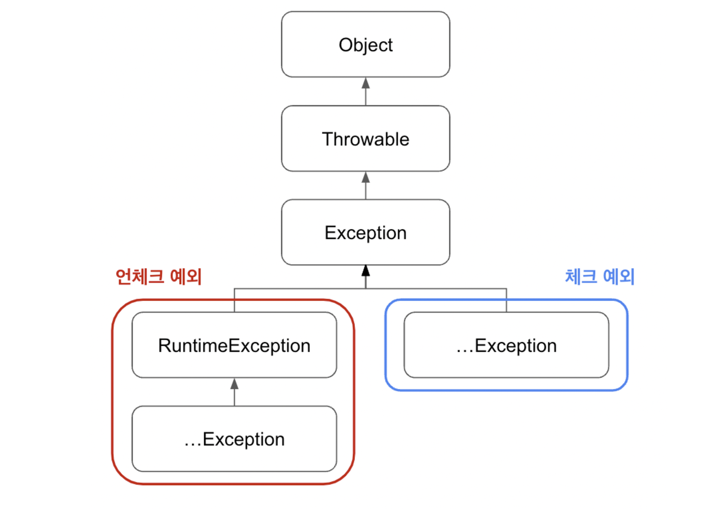

# Exception 알아보기

## 예외 클래스 구조

### 체크 예외
 -  RuntimeException을 상속하지 않은 클래스
- 체크 예외는 복구 가능성이 있는 예외이므로 반드시 예외를 처리하는 코드를 함께 작성해야 한다.

### 언체크 예외
- RuntimeException을 상속 받은 클래스 
- 명시적인 예외처리를 강제하지 않음.
-  NullPointerException,IllegalArgumentException 등

- 스프링 프레임워크가 제공하는 선언적 트랜잭션(@Transactional)안에서 에러 발생 시 체크 예외는 롤백이 되지 않고, 언체크 예외는 롤백이 되기 때문임.

# 예외 처리 방법
### 예외 복구
- 예외 상황을 파악하고 문제를 해결해서 정상 상태로 돌려놓는 것입니다
### 예외 처리 회피
-  예외처리를 자신이 담당하지 않고 자신을 호출한 쪽으로 던져버리는 것  

### 예외 변환
- 생한 예외를 그대로 던지는 것이 아니라 적절한 예외로 전환해서 던짐

1. 내부에서 발생한 예외를 그대로 던지는 것이 그 예외 상황에 대한 적절한 의미를 부여해주지 못하여 적절한 의미를 가진 예외로 넘겨줌.
2. 두 번째 전환 방법은 예외를 처리하기 쉽고 단순하게 만들기 위해 포장(wrap)하는 것입니다. 주로 예외처리를 강제하는 체크 예외를 언체크 예외로 바꾸는 경우에 사용합니다.
# 참고 자료
- https://seodeveloper.tistory.com/entry/JAVA-%EC%98%88%EC%99%B8Exception-%EC%B2%98%EB%A6%AC%EC%97%90-%EB%8C%80%ED%95%B4%EC%84%9C-%EC%95%8C%EC%95%84%EB%B3%B4%EC%9E%90
