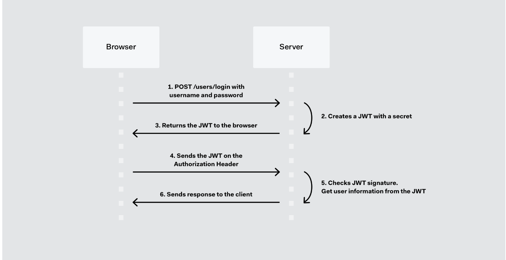
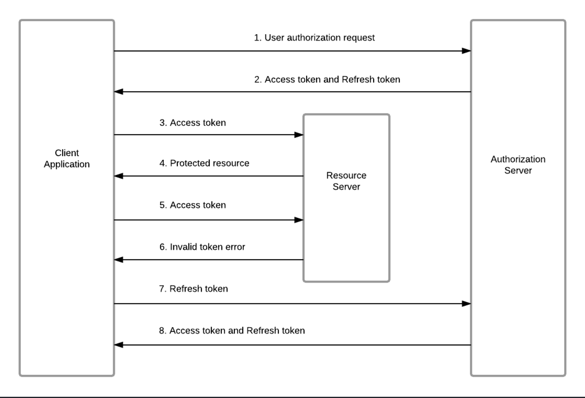

# JWT란?
- 사용자 인증에 필요한 정보들을 암호화하여 저장 후 사용하는 Json Token
- 인증/ 인가에 사용된다.
- 인증(Authentication) : 사용자가 본인인지 확인하는 절차
- 인가(Authorizatioin) : 인증된 사용자가 요청한 경로에 사용자가 접근이 가능한지(권한이 있는지) 결정하는 절차
- JWT 토큰(Access Token)을 HTTP 헤더에 실어 서버가 클라이언트를 식별합니다.

# JWT 구조

#### Header (간단한 토큰 정보)
- 토큰 유형 -> JWT임을 명시
- 사용된 암호화 알고리즘 -> 서명 알고리즘(HMAC SHA256 또는 RSA)입니다.

#### Payload (사용자가 넣어둔 정보)
- 서버와 클라이언트 간 주고 받을 정보
- JWT에 넣을 데이터, JWT 발급 / 만료일 등 내용에 대해 명시
- 민감한 정보는 담지 않는다.
#### Signature 
-   암호화알고리즘((BASE64(Header))+(BASE64(Payload)) + 암호화키)

## JWT 특징
- JWT의 특징은 내부 정보(Header,Payload)를 단순 **BASE64 방식** 으로 인코딩하기 때문에 외부에서 쉽게 디코딩 할 수 있다.

- 외부에서 열람해도 되는 정보를 담아야하며, 토큰 자체의 발급처를 확인하기 위해서 사용한다.
- (토큰이 신뢰할 수 있는지, 나의 서버에서 발급한건지.)
- 비밀번호를 담아버리면 외부에 유출될 수 있음

- (지폐와 같이 외부에서 그 금액을 확인하고 금방 외형을 따라서 만들 수 있지만 발급처에 대한 보장 및 검증은 확실하게 해야하는 경우에 사용한다. 따라서 토큰 내부에 비밀번호와 같은 값 입력 금지)
 
 
## 작동 방식

## 단일 토큰 로직
1. 로그인 성공 JWT 발급 : 서버측 → 클라이언트로 JWT 발급
2. 권한이 필요한 모든 요청 : 클라이언트 → 서버측 JWT 전송
- 토큰을 요청 헤더 Authorization에 포함시켜 함께 전달

# Access/Refresh Token
### Access Token
- 인증을 위한 토큰으로 인증/인가를 위해 필요한 정보들이 담겨있으며 이 토큰은 탈취 위험을 낮추기 위해 약 10분 정도의 짧은 생명주기를 가짐.

### Refresh Token
- Access 토큰이 만료되었을 때 재발급 받기 위한 용도로만 사용되며 약 24시간 이상의 긴 생명주기를 가진다.

## 특징
- 저장 위치는 개인 판단. Access 토큰을 로컬 변수로 저장하는 경우도 있음
### Access
- 주로 Access 토큰을 주로 사용하며 Refresh 토큰 재발급 용도로 쓰이기에 사용 빈도가 낮다.
- Access 토큰은 주로 로컬 스토리지에 저장됩니다. 짧은 생명 주기로 탈취에서 사용까지 기간이 매우 짧고, 에디터 및 업로더에서 XSS를 방어하는 로직을 작성하여 최대한 보호 할 수 있지만 CSRF 공격의 경우 클릭 한 번으로 단시간에 요청이 진행되기 때문입니다.

### Refresh
- Refresh 토큰은 클라이언트에서 Access 토큰과 함꼐 요청을 보냈는데 기간이 만료되어 서버에서 Access 토큰 만료 응답을 보내면 클라이언트는 가지고 있던 Refresh 토큰을 서버로 보내 인증 후 Access 토큰을 재발급 받는다.

- Refresh 토큰은 보통 일회용이다. 한 번 사용 후 Refresh 토큰도 재발급 받는다. -> **Refresh 토큰 Rotate** 이라 한다.

- Refresh 토큰은 주로 쿠키에 저장됩니다. 쿠키는 XSS 공격을 받을 수 있지만 **httpOnly** 를 설정하면 완벽히 방어할 수 있습니다.
    - httpOnly / secure / SameSite 옵션을 설정한다.

### RTR(Refresh Token Rotate)
- 리프레시 토큰도 재발급해서 DB에 기존 리프레시 토큰을 삭제하고 새로운 리프레시 토큰을 발급함.

## Access/Refresh logic

# 참고 자료
- - https://jwt.io/introduction
- https://www.devyummi.com/page?id=669514be59f57d23e8a0b6a9
- https://inpa.tistory.com/entry/WEB-%F0%9F%93%9A-JWTjson-web-token-%EB%9E%80-%F0%9F%92%AF-%EC%A0%95%EB%A6%AC#token_%EC%9D%B8%EC%A6%9D
- https://tecoble.techcourse.co.kr/post/2021-05-22-cookie-session-jwt/