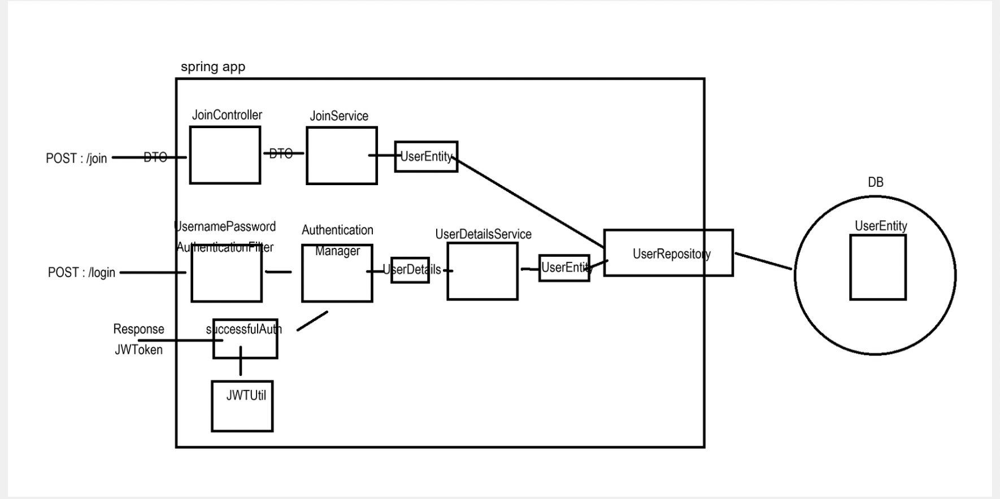
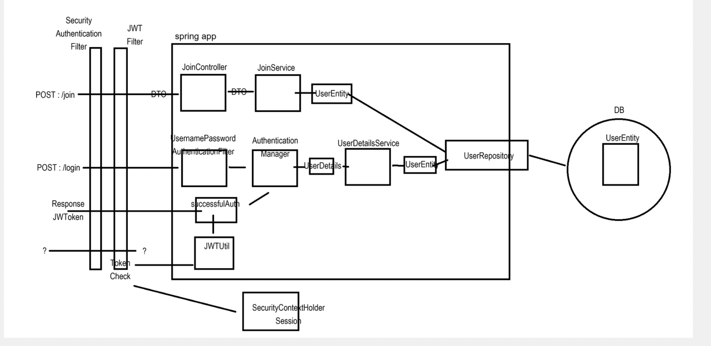
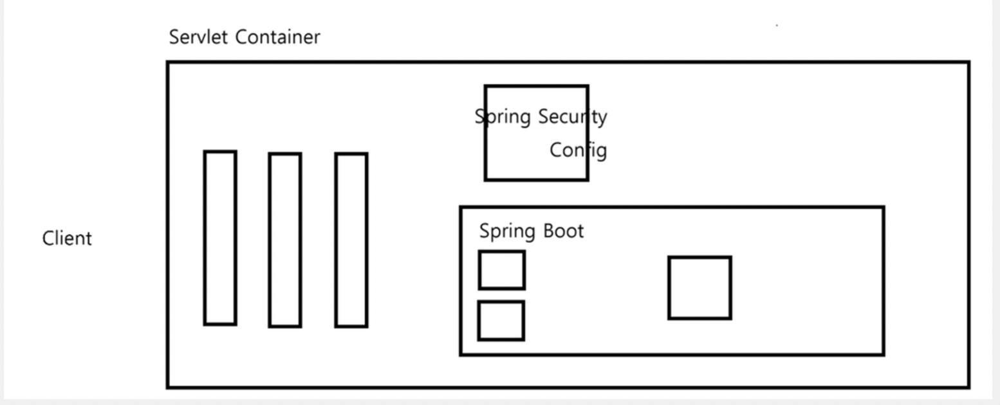
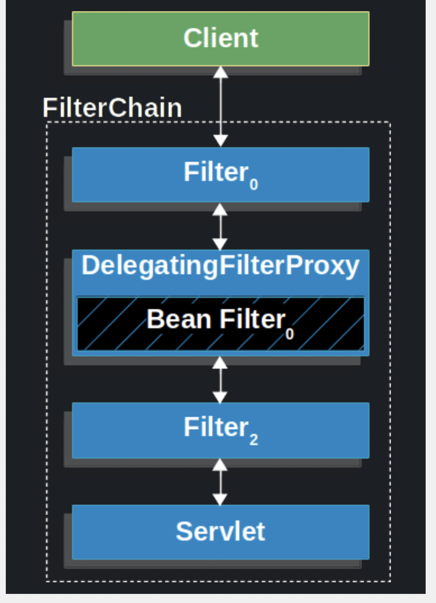
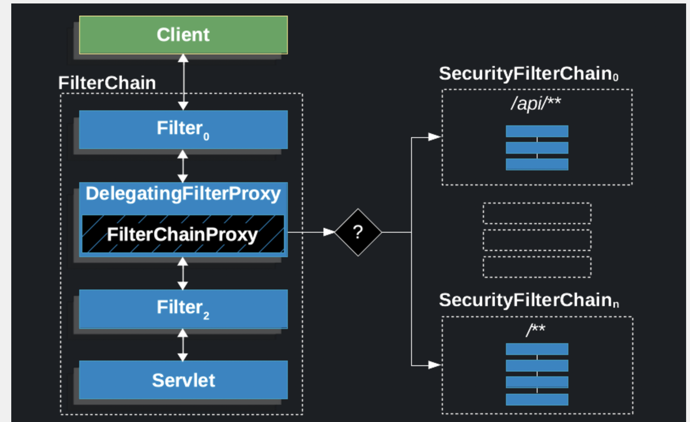

# 동작 원리

## 로그인 (인증) : 로그인 요청을 받은 후 세션 방식은 서버 세션이 유저 정보를 저장하지만 JWT 방식은 토큰을 생성하여 응답한다.

- JWT 로그인 동작 원리(로그인 요청 시)
1. UsernamePassowrdAuthenticationFilter를 통해서 특정한 회원 검증을 하는 로직 작성
2.  Authentication Manager를 통해 내부에서 로그인 검증
    - DB에서 가져와 UserDetailService가 USerDetial에 담아서 Manager를 통해 검증
3. 성공 시 sucessfulAuth메소드를 통해 JWTUtill에서 토큰 생성 후 응답.
실패 시 예외 처리

## 경로 접근 (인가) : JWT Filter를 통해 요청의 헤더에서 JWT를 찾아 검증을하고 일시적 요청에 대한 Session을 생성한다. (생성된 세션은 요청이 끝나면 소멸됨)

1. 요청이 오면 Securityuthenticationfilter가검증을 진행 후 
2. JWT 필터 커스텀해서 필터 검증을 진행함 토큰 확인 후 JWT 필터에서 강제로 일시적인 세션을 만듬. SecurityContextHolder에다가 세션 만듬. 
위에 세션이 있기에 요청 시 확인 가능

- Stateless 형태임

# 스프링 시큐리티 필터 동작 원리
- 스프링 시큐리티는 클라이언트의 요청이 여러개의 필터를 거쳐 DispatcherServlet(Controller)으로 향하는 중간 필터에서 요청을 가로챈 후 검증(인증/인가)을 진행한다.

## 클라이언트 요청 -> 서블릿 필터 -> 서블릿(컨트롤러)

- 위 필터를 활용해서 security를 구현

## Delegating Filter Proxy
서블릿 컨테이너 (톰캣)에 존재하는 필터 체인에 DelegatingFilter를 등록한 뒤 모든 요청을 가로챈다.

- filter중 하나의 filter에게 Delegating Filter 등록

## 서블릿 필터 체인의 DelegatingFilter → Security 필터 체인 (내부 처리 후) → 서블릿 필터 체인의 DelegatingFilter

- 가로챈 요청은 SecurityFilterChain에서 처리 후 상황에 따른 거부, 리디렉션, 서블릿으로 요청 전달을 진행한다.

# 참고 자료
- 개발자 유미 Youtube
- [JWT 공식 홈페이지](https://jwt.io/)