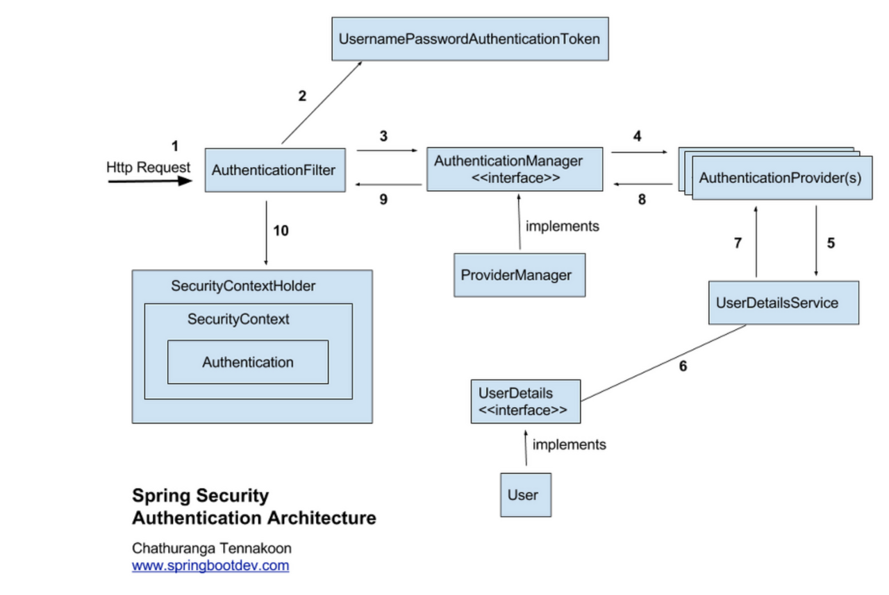

# BCrypt
- 스프링 시큐리티는 사용자 인증 시 비밀번호에 대해 단방향 해시 암호화를 진행하여 비밀번호와 대조한다.
- 스프링 시큐리티는 암호화를 위해 BCrypt PassWord Encoder를 제공하고 권장한다. 따라서 해당 클래스를 리턴하는 메소드를 만들어 @Bean으로 등록 후 사용하면 됨

## 암호화
- 양방향
  - 대칭키
  - 비대칭키
- 단방향
  - 해쉬

## Spring Security 특징
- Filter를 기반으로 동작한다.
- 세션 & 쿠키 구조
- 인증 관리자는 UserNamePasswordAuthenticationFilter, 접근 관리자는 FilterSecurityInterceptor가 수행
  
## 기본 단어
- 인증(Authentication) : 사용자가 본인인지 확인하는 절차
- 인가(Authorizatioin) : 인증된 사용자가 요청한 경로에 사용자가 접근이 가능한지(권한이 있는지) 결정하는 절차
- 접근주체(Principal) : 보호받는 경로(권한이 있어야 접근 가능한 경로)에 접근하려고 하는 사용자
- 비밀번호(Credential) : 경로에 접근하려고 하는 사용자의 비밀번호. 다른말로 접근주체의 비밀번호라고도 할 수 있다.

## Spring Security 동작 원리
<br><br>
  

1. 사용자가 로그인 요청
2. 토큰 생성 
   - AuthenticationFilter가 요청을 받아서 UsernamePasswordAuthenticationToken 토큰(인증용 객체)을 생성
3.  AuthenticationFilter에서 생성된 UsernamePasswordAuthenticationToken을 AuthenticationManager에게 전달함
    - AuthenticationManager에게 인증 진행하라고 한다.
4.  AuthenticationManager는 등록된 AuthenticationProvider(들)을 조회하여 인증을 요구함
    -  AuthenticationManager는 List 형태로 AuthenticationProvider들을 가지고 있는데, 실제로 인증을 할 AuthenticationProvider에게 인증용 객체(토큰)를 다시 위임한다.
5. 인증 절차
   - 선택된 AuthenticationProvider는 UserDetailsService를 통해 입력받은 아이디에 대한 사용자 정보를 DB에서 조회함
   - UserDetailsService 인터페이스는 로그인페이지에서 입력한 아이디(username)를 통해 loadUserByUsername() 메서드를 호출하여 DB에 있는 사용자 정보를 UserDetails 형태로 가져온다. 없을 시 예외 던짐.
6. 인증 성공
   -  인증 정보를 담고 있는 Authentication 객체를 생성해서 AuthenticationManager에게 전달
   -  AuthenticationManager는 AuthenticationFilter에게 전달
7.  Authentication 객체를 SecurityContextHolder라는 곳에 저장 후 AuthenticationSuccessHandler을 실행한다.
    - 더 자세히 보면 Authentication객체는 SecurityContext에 저장된다. 
        -  SecurityContext: 사용자 인증 정보를 담고 있는 객체
        -  Authentication 객체
           -  사용자의 인증 정보를 실제로 담고 있는 객체로, 주로 사용자 이름, 비밀번호, 권한 정보 등이 포함됩니다.
    - SecurityContextHolder는 SecurityContext를 관리하는 클래스이다.
  ~~~ java
        Authentication authentication = SecurityContextHolder.getContext().getAuthentication();
  ~~~

## 동작 원리 참고 자료
- https://skatpdnjs.tistory.com/41
  
  
## 세션 정보 가져오기
``` java
SecurityContextHolder.getContext().getAuthentication().getName();
```
 - spring Security에서 현재 인증된 사용자의 이름(일반적으로 사용자 ID 또는 사용자명)을 가져오는 코드입니다.


<br>

``` java
Authentication authentication = SecurityContextHolder.getContext().getAuthentication();

Collection<? extends GrantedAuthority> authorities = authentication.getAuthorities();
Iterator<? extends GrantedAuthority> iter = authorities.iterator();
GrantedAuthority auth = iter.next();
String role = auth.getAuthority();
```
-  spring Security에서 현재 로그인한 사용자의 **권한(role)**을 가져오는 작업
  

# 세션 설정
- 로그인 정보
  - 사용자가 로그인을 진행한 뒤 사용자 정보는 SecurityContextHolder에 의해서 서버 세션에 관리된다.

### 세션 소멸 시간 설정
- 세션 타임아웃 설정을 통해 로그인 이후 세션이 유지되고 소멸하는 시간을 설정할 수 있다.
- 세션 소멸 시점은 서버에 마지막 특정 요청을 수행한 뒤 설정한 시간 만큼 유지된다. (기본 시간 1800초)
~~~ java
//초 기반
server.servlet.session.timeout=1800

//분 기반
server.servlet.session.timeout=90m
~~~


### 다중 로그인 설정
~~~ java
@Bean
public SecurityFilterChain securityFilterChain(HttpSecurity http) throws Exception{

    http
            .sessionManagement((auth) -> auth
                    .maximumSessions(1)
                    .maxSessionsPreventsLogin(true));

    return http.build();
}
~~~

- sessionManagement() 메소드를 통한 설정을 진행한다.

 

- maximumSession(정수) : 하나의 아이디에 대한 다중 로그인 허용 개수

- maxSessionPreventsLogin(불린) : 다중 로그인 개수를 초과하였을 경우 처리 방법

    - true : 초과시 새로운 로그인 차단
    - false : 초과시 기존 세션 하나 삭제

### 세션 고정 보호
- 세션 고정 공격을 보호하기 위한 로그인 성공시 세션 설정 방법은 sessionManagement() 메소드의 sessionFixation() 메소드를 통해서 설정할 수 있다.
- sessionManagement().sessionFixation().none() : 로그인 시 세션 정보 변경 안함

- sessionManagement().sessionFixation().newSession() : 로그인 시 세션 새로 생성 
- sessionManagement().sessionFixation().changeSessionId() : 로그인 시 동일한 세션에 대한 id 변경
  
~~~ java
@Bean
public SecurityFilterChain securityFilterChain(HttpSecurity http) throws Exception{

    http
            .sessionManagement((auth) -> auth
                    .sessionFixation().changeSessionId());
// changeSessionId()를 주로 씀
    return http.build();
}
~~~

