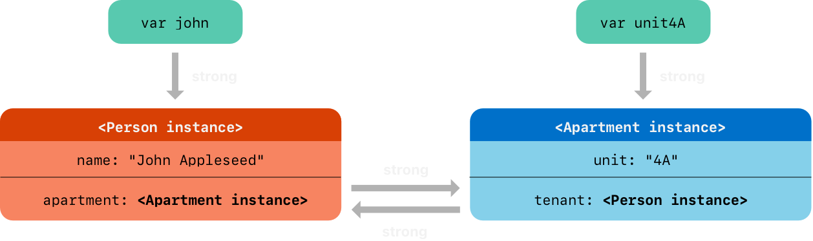
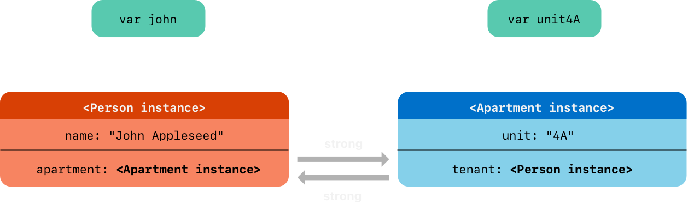
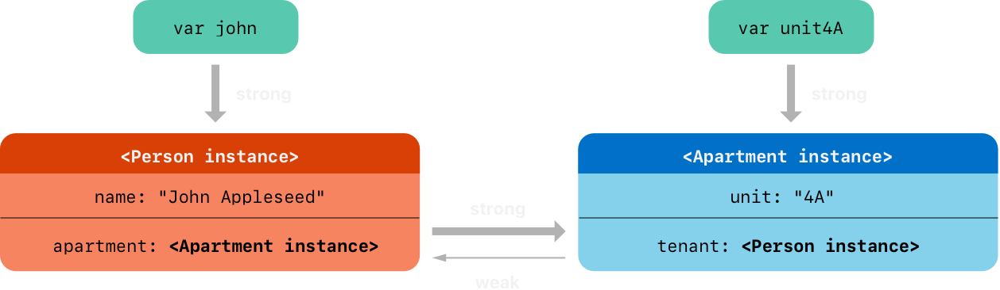
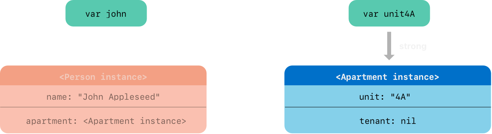
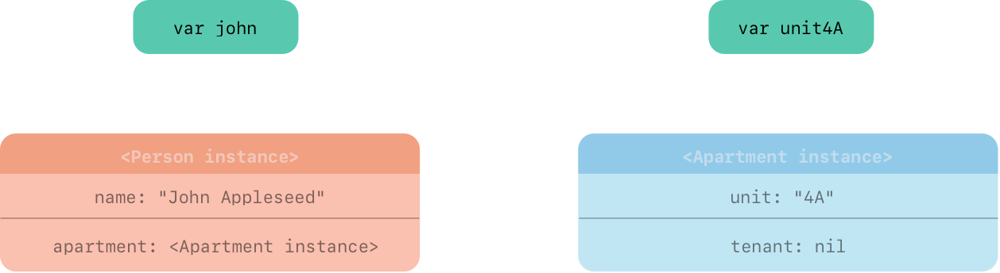

# 클래스 인스턴스 사이의 강한 참조 사이클 (Strong Reference Cycles Between Class Instances)

- 클래스의 인스턴스가 강한 참조가 없는 지점에 도달하지 않는 코드를 작성할 수 있습니다. 이는 두 클래스 인스턴스가 서로에 대한 강한 참조를 유지하여 각 인스턴스가 다른 인스턴스를 유지하는 경우 발생할 수 있습니다. 이것은 **강한 참조 사이클 (strong reference cycle)** 이라고 합니다.

- 예시
~~~swift
class Person {
    let name: String
    init(name: String) { self.name = name }
    var apartment: Apartment?
    deinit { print("\(name) is being deinitialized") }
}

class Apartment {
    let unit: String
    init(unit: String) { self.unit = unit }
    var tenant: Person?
    deinit { print("Apartment \(unit) is being deinitialized") }
}
~~~
```swift
var john: Person?
var unit4A: Apartment?

john = Person(name: "John Appleseed")
unit4A = Apartment(unit: "4A")
```

- 다음은 강한 참조가 이 두 인스턴스를 생성하고 할당하여 어떻게 보이는지 나타냅니다. john 변수는 이제 새로운 Person 인스턴스에 대한 강한 참조를 가지고 있고 unit4A 변수는 새로운 Apartment 인스턴스에 대한 강한 참조를 가지고 있습니다:
  

<br/><br/>

~~~swift
john!.apartment = unit4A
unit4A!.tenant = john
~~~
- 인스턴스 연결
<br/><br/><br/>



- 이 두 인스턴스 연결은 서로간의 강한 참조 사이클을 생성합니다. Person 인스턴스는 이제 Apartment 인스턴스에 대한 강한 참조를 가지고 Apartment 인스턴스는 Person 인스턴스에 대한 강한 참조를 가집니다. 따라서 john 과 unit4A 변수에 의해 가진 강한 참조를 중단할 때 참조 카운트는 0으로 떨어지지 않고 인스턴스는 ARC에 의해 할당 해제되지 않습니다:


<br/><br/>

``` 
john = nil
unit4A = nil
```
- 두 변수를 nil 로 설정할 때 초기화 해제 구문은 호출되지 않습니다. 강한 참조 사이클은 Person 과 Apartment 인스턴스가 할당 해제되는 것을 방지하여 앱에서 메모리 누수를 유발합니다.

<br/><br/>



- nil로 설정한 후에도 강한 참조가 남아있게 된다.


## 클래스 인스턴스 간의 강한 참조 사이클 해결 (Resolving Strong Reference Cycles Between Class Instances)

- Swift는 클래스 타입의 프로퍼티와 작업할 때 강한 참조 사이클을 해결하기 위해 2가지 방법을 제공합니다: **약한 참조 (weak references)**와 **미소유 참조 (unowned references)**
- 약한 참조와 미소유 참조를 사용하면 참조 사이클의 한 인스턴스가 강한 유지 없이 다른 인스턴스를 참조할 수 있습니다. 그런 다음 인스턴스는 강한 참조 사이클을 만들지 않고도 서로를 참조할 수 있습니다.
- 약한 참조(weak references)는 언제 사용?
    - 다른 인스턴스의 수명이 더 짧은 경우 즉, 다른 인스턴스가 먼저 할당 해제될 수 있을 때 약한 참조를 사용합니다. 위의 Apartment 예제에서 아파트는 어느 시점에 소유자가 없을 수 있는 것이 적절하므로 이러한 경우 약한 참조는 참조 사이클을 끊는 적절한 방법입니다. 
- **약한 참조 (Weak References)**
    - 약한 참조 (weak reference) 는 참조하는 인스턴스를 강하게 유지하지 않는 참조이므로 ARC가 참조된 인스턴스를 처리하는 것을 중지하지 않습니다. 이러한 동작은 참조가 강한 참조 사이클의 일부가 되는 것을 방지합니다. 프로퍼티 또는 변수 선언 전에 ***weak 키워드*** 를 위치시켜 약한 참조를 나타냅니다.
  
    - 약한 참조는 참조하는 인스턴스를 강하게 유지하지 않기 때문에 약한 참조가 참조하는 동안 해당 인스턴스가 할당 해제될 수 있습니다. 따라서 ARC는 참조하는 인스턴스가 할당 해제되면 nil 로 약한 참조를 자동으로 설정합니다. 그리고 약한 참조는 런타임에 값을 nil 로 변경하는 것을 허락해야 하므로 항상 옵셔널 타입의 상수가 아닌 변수로 선언됩니다.
- 
다른 옵셔널 값과 같이 약한 참조에 값의 존재를 확인할 수 있고 더이상 존재하지 않는 유효하지 않은 인스턴스에 참조하는 것으로 끝나지 않습니다.

## 약한 참조(weak references) 예시
~~~swift
class Person {
    let name: String
    init(name: String) { self.name = name }
    var apartment: Apartment?
    deinit { print("\(name) is being deinitialized") }
}

class Apartment {
    let unit: String
    init(unit: String) { self.unit = unit }
    weak var tenant: Person? // 약한 참조
    deinit { print("Apartment \(unit) is being deinitialized") }
}

var john: Person?
var unit4A: Apartment?

john = Person(name: "John Appleseed")
unit4A = Apartment(unit: "4A")

john!.apartment = unit4A
unit4A!.tenant = john

~~~


<br/><br/>


- Person 인스턴스는 Apartment 인스턴스에 대해 아직 강한 참조를 가지고 있지만 Apartment 인스턴스는 이제 Person 인스턴스에 대해 약한 참조를 가지고 있습니다. 이것은 john 변수에 nil 을 설정하여 강한 참조를 끊으면 Person 인스턴스에 대해 더이상 강한 참조가 아님을 의미합니다
~~~ 
john = nil
~~~
- 더이상 Person 인스턴스에 대해 강한 참조를 가지지 않기 때문에 할당 해제되고 tenant 프로퍼티는 nil 로 설정됩니다:
  
<br/><br/>



```
unit4A = nil
// Prints "Apartment 4A is being deinitialized"

```
- Apartment 인스턴스에 대한 강한 참조가 더이상 없으므로 할당 해제됩니다:

<br/><br/>




# 강한 참조와 약한 참조 깊게 알아보기!
- 강한 참조
  - 자신이 참조하는 인스턴스의 소유권을 가지게 됩니다.
또한 강한참조를 하게 되면 RC가 증가하게 됩니다.
우리가 사용할 떄 아무것도 적어주지 않으면 강한참조로 선언이 됩니다.
Default가 strong으로 되어 있기 때문입니다.
  - 강한참조의 문제점은 순환참조가 발생할 수 있다는 것입니다.

- 약한참조
  - 해당 인스턴스의 소유권을 가지지 않고, 주소값만 가지고 있는 포인터 개념
  - 약한참조는 RC를 증가시키지 않습니다.
  - 약한 참조는 참조하는 인스턴스를 강하게 유지하지 않기 때문에 약한 참조가 참조하는 동안 해당 인스턴스가 할당 해제될 수 있습니다. 따라서 ARC는 참조하는 인스턴스가 할당 해제되면 nil 로 약한 참조를 자동으로 설정합니다. 그리고 약한 참조는 런타임에 값을 nil 로 변경하는 것을 허락해야 하므로 항상 옵셔널 타입의 상수가 아닌 변수!로 선언됩니다.
  - 
## 참고 자료

1. Swift 공식문서 https://bbiguduk.gitbook.io/swift/language-guide-1/automatic-reference-counting#strong-reference-cycles-between-class-instances

2. https://yudonlee.tistory.com/35
3. https://velog.io/@qudgh849/메모리-참조-strong-weak-unowned-순환참조